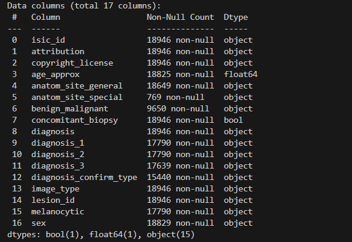
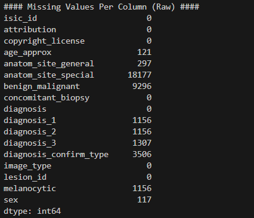
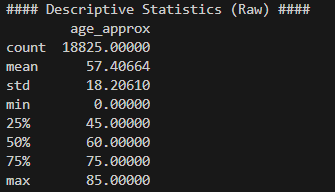
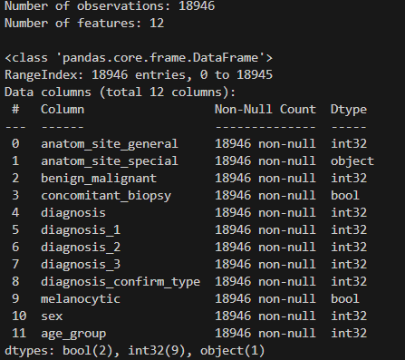
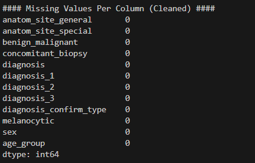
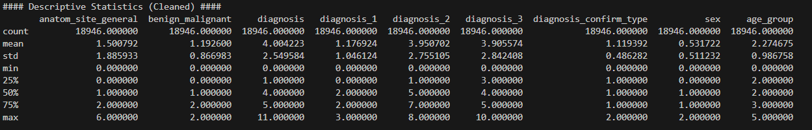

# Data Exploration and Preprocessing
## Data Pre Cleaning:
- Contains 18946 observations
- 

- 
- 

## Cleaned Data

- Dropped 'isic_id','lesion_id','attribution','copyright_license','image_type'
  - These columns contain identification for specific images associated with the data, as well as irrelavant data that in no way helps in training our bayesian model.
- Processed the 'age' column into specific age ranges
- Converted boolean columns into boolean types(True/False)
- Encoded 'anatom_site_general', 'benign_malignant','diagnosis',
'diagnosis_1', 'diagnosis_2', 'diagnosis_3',
'diagnosis_confirm_type', 'sex', 'age_group'
  - mapped non-integer values to integers to be able to calculate probablities.
- Enoded missing values as 'Unknown'
- 
- 
- 
