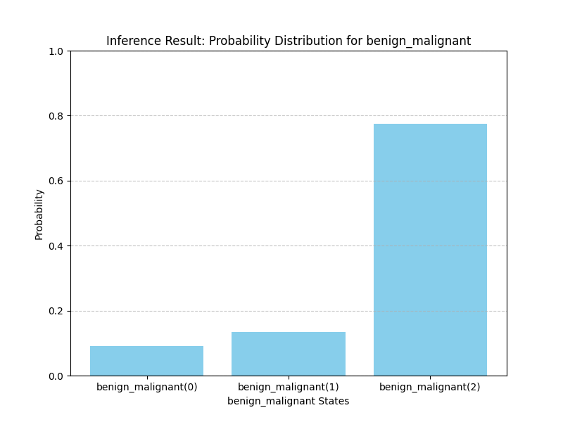
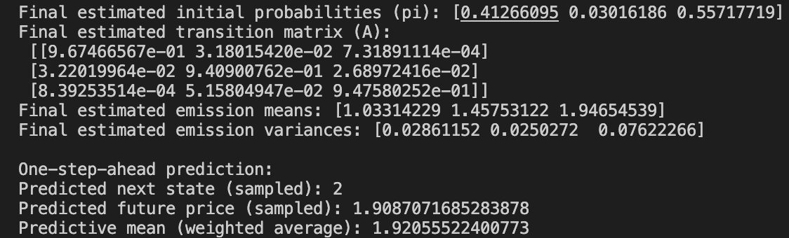
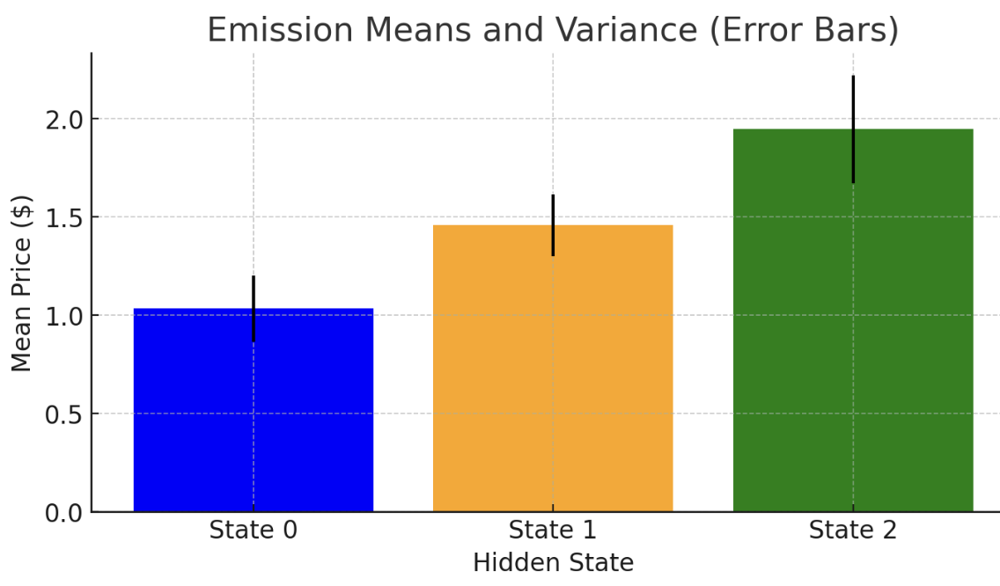
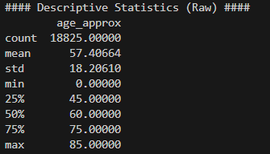
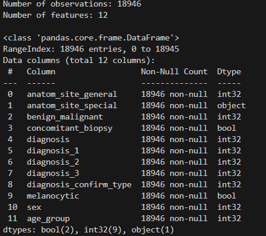
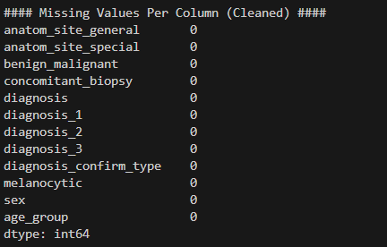
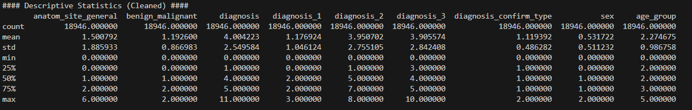

# Medical Image Analysis
## UPDATED SECTION
### Agent Setup Visualization

The Bayesian agent's inference result is visualized below. This plot shows the probability distribution for the target variable `benign_malignant` based on the provided evidence. The agent updates its beliefs according to the evidence, and the resulting probability distribution is displayed for clarity.



*Note: The plot is generated automatically when running `python3 Models/bayesian_agent.py` with default or supplied command-line evidence.*

### Model Evaluation

Our first model was evaluated using the Bayesian network trained on 18,946 observations. Inference was performed using either the default evidence or command-line provided evidence. For example, using the default evidence:
- **sex:** 1  
- **anatom_site_general:** 2  
- **age_group:** 3  

The model produced the following probability distribution:
- `benign_malignant(0)`: ~9.14%
- `benign_malignant(1)`: ~13.39%
- `benign_malignant(2)`: ~77.47%

This evaluation demonstrates that the model successfully updates its beliefs based on the provided evidence. Future evaluations will include testing on a hold-out dataset and using metrics such as accuracy, ROC-AUC, precision, recall, F1-score, and calibration curves.

### Evidence Handling
The Bayesian agent now supports dynamic evidence input via command-line arguments. If no evidence is provided, the agent falls back to default values. The default sets the evidence to:
- **sex = 1**
- **anatom_site_general = 2**
- **age_group = 3**

## Conclusion and Future Work
### Conclusion
The initial model demonstrates the viability of using Bayesian networks for probabilistic skin lesion diagnosis. It successfully learns Conditional Probability Distributions (CPDs) from clinical metadata and performs inference to yield interpretable probability estimates for benign_malignant based on patient features. The current output (e.g., 9.14%, 13.39%, and 77.47%) provides a preliminary indication of the model’s belief distribution, though further evaluation with rigorous metrics is needed to fully assess its clinical utility.

### Future Improvements
- **Enhanced Network Structure:**  
  Incorporate additional features (e.g., imaging-derived features, biopsy details) to improve predictive performance.
- **Dynamic Evidence Integration:**  
  Replace hard-coded evidence with real-time data inputs from clinical systems or user interfaces.
- **Advanced Evaluation:**  
  -***Split data into training and testing subsets.***
  - ***Apply cross-validation.***
  - ***Compute metrics like ROC-AUC, precision, recall, and calibration curves.***
  - ***Use these metrics to refine and calibrate the model.***
- **Uncertainty Visualization:**  
  Develop intuitive visualization methods for uncertainty estimates to support clinical decision-making.

## END OF UPDATED SECTION

## Overview

This project develops a probabilistic agent that leverages a Bayesian network for real-time skin lesion diagnosis. The system classifies skin lesions (e.g., distinguishing between benign and malignant lesions) while providing uncertainty estimates for its predictions. It is designed for integration into clinical workflows to support dermatologists in making accurate diagnostic decisions.

## PEAS Framework

- **Performance:**  
  The agent’s performance is measured by its diagnostic accuracy and the calibration of its probability estimates. It aims to minimize misdiagnosis while providing interpretable uncertainty measures.

- **Environment:**  
  The "world" for this agent is the clinical setting where patient data, including both imaging and associated metadata (e.g., age, sex, lesion site), are available. The environment is dynamic and uncertain, requiring real-time inference.

- **Actuators:**  
  The agent outputs a diagnosis with probability distributions (e.g., the likelihood of benign versus malignant lesions) and visual uncertainty metrics. These outputs can be displayed on a dashboard or integrated into existing clinical decision support systems.

- **Sensors:**  
  Sensors include medical imaging devices and data acquisition systems that capture patient metadata such as age, sex, and anatomical site.

## Agent Type and Probabilistic Modeling

This is a **goal-based probabilistic agent**. It is designed to achieve the goal of accurate skin lesion classification by updating its beliefs about a lesion’s diagnosis as new evidence is observed. The agent is built on Bayesian networks, a probabilistic graphical model that captures the conditional dependencies among various patient features and diagnostic outcomes. The model learns conditional probability distributions (CPDs) from preprocessed clinical data, and inference (using Variable Elimination) is performed to compute posterior probabilities based on observed evidence.

## Data Preprocessing and Model Training
### Data Pre Cleaning:
- Contains 18946 observations
- 

- 
- 

### Cleaned Data

- Dropped 'isic_id','lesion_id','attribution','copyright_license','image_type'
  - These columns contain identification for specific images associated with the data, as well as irrelavant data that in no way helps in training our bayesian model.
- Processed the 'age' column into specific age ranges
- Converted boolean columns into boolean types(True/False)
- Encoded 'anatom_site_general', 'benign_malignant','diagnosis',
'diagnosis_1', 'diagnosis_2', 'diagnosis_3',
'diagnosis_confirm_type', 'sex', 'age_group'
  - 'diagnosis_1', 'diagnosis_2', 'diagnosis_3' represent 3 possible diagnosis for a skin lesion, need to be converted to integer values to calculate probabilities
  - 'diagnosis_confirm_type' is the most certain diagnosis, higher prob mapping
  - 'sex' male(1) and female(0)
  - 'age_group' enocoded as integers 1-4 to ensure smooth probability calulations
  - mapped non-integer values to integers to be able to calculate probablities.
- Enoded missing values as 'Unknown'
- 
- 
- 

### Model Training

The Bayesian network is defined and trained in `Models/bayesian_agent.py`:
- **Network Structure:**  
  The network is defined such that `sex`, `anatom_site_general`, and `age_group` serve as parent nodes influencing the target node `benign_malignant`.
  
  ```python
  model = BayesianNetwork([
      ("sex", "benign_malignant"),
      ("anatom_site_general", "benign_malignant"),
      ("age_group", "benign_malignant")
  ])

## Model Evaluation

Our first model was evaluated using the Bayesian network trained on 18,946 observations. We performed inference by querying the model with a set of hard-coded evidence, and examined the resulting probability distribution for the target variable `benign_malignant`. For example, given the evidence:
- **sex**: 1
- **anatom_site_general**: 2
- **age_group**: 3

the model produced the following probability distribution:
- `benign_malignant(0)`: 9.14%
- `benign_malignant(1)`: 13.39%
- `benign_malignant(2)`: 77.47%

This evaluation demonstrates that the model is able to update its beliefs based on the input evidence. Further evaluation will be performed on a hold-out test set using metrics such as accuracy, ROC-AUC, precision, recall, and F1-score, as well as calibration curves to assess the reliability of the probability estimates.

## Code and Notebooks

All code and notebooks related to this project have been uploaded to the repository. Key files include:
- **Data Processing:** [Data/Processed_data/process_data.py](https://github.com/SamHormozian/Medical_Image_Analysis_with_Risk_Assessment/blob/milestone2/Data/Processed_data/process_data.py)
- **Bayesian Agent:** [Models/bayesian_agent.py](https://github.com/your_username/Medical_Image_Analysis_with_Risk_Assessment/blob/milestone2/Models/bayesian_agent.py)
- **Data Source:** The raw metadata is available at [Data/Raw_data/metadata/metadata.csv.gz](https://github.com/your_username/Medical_Image_Analysis_with_Risk_Assessment/blob/milestone2/Data/Raw_data/metadata/metadata.csv.gz)


## Conclusion and Future Work

### Conclusion
The initial model demonstrates the viability of using Bayesian networks for probabilistic skin lesion diagnosis. It successfully learns conditional probability distributions (CPDs) from the clinical metadata and performs inference to yield interpretable probability estimates for `benign_malignant` based on the patient features. While the results are promising, the model is still in its early stages and requires further testing and validation.

### Future Improvements
- **Enhanced Network Structure:**  
  Incorporate additional features (e.g., imaging-derived features, biopsy information) to improve diagnostic performance.
- **Dynamic Evidence Integration:**  
  Replace hard-coded evidence with real-time data inputs from clinical systems or user interfaces.
- **Advanced Evaluation:**  
  Apply robust evaluation techniques such as cross-validation, ROC-AUC analysis, and calibration curves to better assess and improve model performance.
- **Uncertainty Visualization:**  
  Develop intuitive visualization methods for uncertainty estimates to support clinical decision-making.
